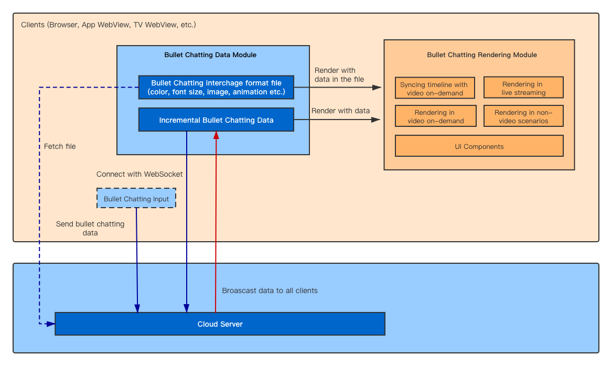

# Logical Architecture Diagram for Bullet Chatting 

- In Bullet Chatting client there are mainly Bullet Chatting Data and Rendering modules
- On initialization, the client loads Bullet chatting interchange format file from the server
- When running, the client get incremental bullet chatting data by using websocket or polling
- Rendering Module shall cover 3 scenarios: video on-demand, live streaming, non-video
- Server and clients are from the same provider

# interoperability for Bullet Chatting

Threre is no requirement for interoperability at present, but developers do have portability requirement. Developers may deploy applications on multiple OS and platforms (Wechat MiniApps, Alipay MiniApps, Baidu MiniApps, etc.). A standarized file format can guide the Platform service provider and save cost of migration for developers and companies.
